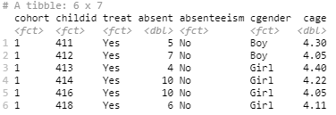

```{R, setup, include = FALSE}
if (!require(pacman)) install.packages('pacman', repos = 'https://cran.rstudio.com')
pacman::p_load(here, tidyverse, ggplot2, xaringan, knitr, kableExtra)

opts_chunk$set(include = FALSE)
```

### 1. Submission Requirements

Please upload below two files on Canvas before TBD time:  

 * An .html or .pdf file that includes both - 
   + your typed responses (in your own words and not identical to anybody else's), tables, and/or figures to the problems  
   + and the R code chunks that generated your answers (hint: in your Rmd file, set up echo = TRUE, include = TRUE)  
   
 * The .Rmd or .R file that you used to render the tables and figures in the above html/pdf. You'll be cut TBD points if the Rmd doesn't run or render properly.

### 2. Objectives of this assignment

 * Describe and summarize categorical data

 * Create visualizations of categorical data

### 3. Data Background

The dataset we'll be using in this assignment is drawn from the NCRECE [Teacher Professional Development Study (PDS)](https://www.icpsr.umich.edu/web/ICPSR/studies/34848) data. PDS is a randomized controlled evaluation of two forms of professional development (PD) - coursework (phase 1) and consultancy (phase 2) - delivered to about 490 early childhood education teachers across the nation. These PD supports aim to improve teachers' implementation of language/literacy activities and interactions with children, as well as promote gains in children's social and academic development. 

One of the research questions we're interested in is whether the consultancy PD support impacts student attendance outcomes. This involves an understanding of the nature of the treatment variable and student attendance measures as well as the relationships between them. Although PDS didn't target student attendance outcomes, studies show that the PD support improved student attendance and reduced student absenteeism (e.g., [Hanno and Gonzalez, 2020](https://doi.org/10.1080/19345747.2019.1634170)). 

**Sample**. Our dataset is student-level data for 942 preschool children. Due to the large attrition of teachers and students from phase 1 to 2, we limit our sample students to those who have participated phase 2 and have no missing values on attendance (33.05% missing from the original 1,407 children), gender (no missing), and age (no missing). 

**Key variables**. The original outcome variable is days of absence. We include it in our dataset and compute a dichotomous variable, *absenteeism*, based on that a student is considered chronically absent when she misses 10 percent and more days during a school year (180 days). A brief description of the variables is as following:

 * *cohort*, which cohort the child was in. Note that PDS had two cohort, cohort 1 participated in 07/08 for phase 1 and 08/09 for phase 2, cohort 2 participated in 08/09 for phase 1 and 09/10 for phase 2.
 * *childid*, the child's unique indentification number.
 * *treat*, treatment condition measure, which is coded 1 if the child's teacher was in the consultancy treatment group, coded 0 if the child's teacher was in the control group.
 * *absent*, the number of days the child was absent from the beginning of school year (08 fall for cohort 1 and 09 fall for cohort 2) to the date the child's teacher rating result posted. 
 * *absenteeism*, measure of chronic absenteeism, coded 1 if the child missed 10 percent or more school days and 0 if not. (*ISSUE: I need to see the Hanno and Gonzalez paper and check how they computed this variable because the date the child's teacher rating result posted has 215 more obs missing, which leads to a severe reduction of sample size. I required inter-library loan for the paper but yet to receive it*).
 * *cgender*, the child's gender, coded 1 for girls and 0 for boys.
 * *cage*, the child's age in years at beginning of study, cohort 1: 2008 - e_Dob, cohort 2: 2009 – e-Dob.

### 4. Assignment Details

#### 4.1. Read in the dataset

Open your RStudio, create a project and save it to your local. Go to the root directory of the project and create a folder named "data". Download the dataset from Canvas then store it in the folder "data". Create an Rmd/R file in the project root directory. To read the dataset into your Rmd/R file, use the code chunk below (it's important that you copy-paste the entire code):

```{r, include = TRUE, warning = FALSE}
pd <- read_csv(here::here("data", "cat.csv"), col_types = "ffnnnnn")
```

#### 4.2. Understand the structure of the data

4.2.1. Write your own code to view the dataset and write a couple of sentences about the structure of the data (how many variables, the type of each variable, how many rows/observations, etc.) with a focus on the two key variables, *treat* and *absenteeism* (type, observations, etc.).

```{r}
# head(pd)
# str(pd)
```

4.2.2. Write your own code to transform the variables, *treat*, *absenteeism*, and *cgender* into factor and label them consistently with the data background information above. Then view the data using head(), you should see something like .

```{r}
# pd$treat <- factor(pd$treat, levels = c(0,1), labels = c("No", "Yes"))
# pd$absenteeism <- factor(pd$absenteeism, levels = c(0,1), labels = c("No", "Yes"))
# pd$cgender <- factor(pd$cgender, levels = c(0,1), labels = c("Boy", "Girl"))
# head(pd)
```

#### 4.3. Describe and summarize the two key variables

4.3.1. How many students were in the treatment group? Control group? Provide your response and create a table AND a figure to demonstrate your answer.

4.3.2. How many students were chronically absent? Provide your response and create a table AND a figure to demonstrate your answer.


