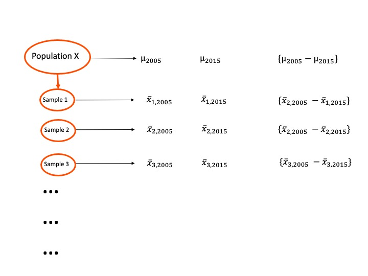

```{r setup, include = FALSE}
options(htmltools.dir.version = FALSE)

knitr::opts_chunk$set(warning = FALSE,
                      message = FALSE,
                      echo = FALSE,
                      fig.align = "center",
                      fig.height = 3)

if (!require(pacman)) install.packages('pacman', repos = 'https://cran.rstudio.com')
pacman::p_load(tidyverse, here, knitr, dplyr, ggplot2, blogdown, rio, gifski)
```

```{r, echo = F}
who <- import(here::here("data", "life_expectancy.csv")) %>% 
  janitor::clean_names() %>% 
  filter(year == 2005 | year == 2015) %>% 
  select(country, status, year, life_expectancy) %>% 
  mutate(life_expectancy = round(life_expectancy, digits = 0))

who_wide <- who %>% 
  pivot_wider(id_cols = c(country), names_from = year, values_from = life_expectancy) %>% 
  select(country, `2005`, `2015`)

```

---
# Measuring Change

* Sometimes we are interested in how subjects change over time:
  + Are childrens' reading scores significantly higher after a six-week summer reading intervention?
  + Are maternal and paternal depressive symptoms lower after being exposed to a family therapy program?

* Participants are now measured on multiple occasions/conditions/time points.

* Observations are no longer independent - data points are "grouped" within one individual or subject.

---
# Dependent Samples T-Test

* A dependent samples t-test acknowledges that our groups are not separate random samples.

Suppose we wanted to determine if life expectancy in 2015 was signfificantly different than in 2005.

```{r, echo = F}
head(who_wide)
```

By comparing the change in life expectancy within a sample of countries, we have less random "noise" than we'd find by using separate random samples in 2005 and 2015.

---
# Dependent Samples T-Test

Imagine we have randomly sampled 10 countries from the world population and measured their average life expectancy in 2005 and 2015.

.pull-left[
```{r, echo = F}
set.seed(100)
samp1 <- who_wide %>% 
  sample_n(10)

print(samp1)
```
]
.pull-right[
$$\bar{X}_{2005} = 63.1 \rightarrow \bar{X}_{2015} = 67$$
$$s_{2005} = 10.64 \rightarrow s_{2015} = 10.10$$
]

* Does our sample's increase in life expectancy reflect a true population difference?
* Or, is our sample just peculiar, and our increase in life expectancy just a random occurrence due to sampling variability?

---
# Sampling Distribution
```{r, out.width = "75%", echo=F}
  
```

Our null hypothesis is that there is no difference between $\mu_{2005}$ and $\mu_{2015}$.

$$H_0: \mu_{2005} = \mu_{2015} \rightarrow H_0: \mu_{2005} - \mu_{2015} = 0$$

---
# Dependent Samples T-test

To test our null hypothesis, we simply need to conduct a t-test on our difference scores.

$$H_0: \mu_{2005} - \mu_{2015} = 0 \rightarrow H_0: \mu_{diff} = 0$$
Essentially, we are conducting a one-sample t-test on our difference scores, where $K = 0$.

.pull-left[
```{r}
samp1 <- samp1 %>% 
  mutate(difference = `2015` - `2005`)
samp1
```
]

.pull-right[
$$\bar{X}_{diff} = 3.9$$

$$s_{diff} = 3.63$$
]

---
# Sampling Distribution

What does our sampling distribution look like?
* Under the null hypothesis, the sampling distribution of *difference scores* has a mean of 0 $\mu_{diff} = 0$. 

* The standard deviation reflects the standard error of difference scores.

$$ t_{df} = \frac{\bar{X}_{diff} - \mu_{diff}}{\frac{\hat{\sigma}_{diff}}{\sqrt{N}}} $$