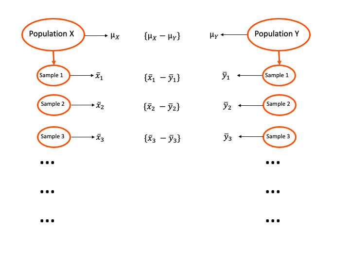

class: inverse, center, middle

```{r setup, include = FALSE}
options(htmltools.dir.version = FALSE)

knitr::opts_chunk$set(warning = FALSE,
                      message = FALSE,
                      echo = FALSE,
                      fig.align = "center",
                      fig.height = 3)

if (!require(pacman)) install.packages('pacman', repos = 'https://cran.rstudio.com')
pacman::p_load(tidyverse, here, knitr, dplyr, ggplot2, blogdown, rio, gifski, palmerpenguins)
```


```{r, echo = F}
who <- import(here::here("data", "life_expectancy.csv")) %>% 
  janitor::clean_names() %>% 
  filter(year == 2015) %>%
  select(country, status, year, life_expectancy) %>% 
  rename(region = country) %>% 
  mutate(life_expectancy = round(life_expectancy, digits = 0))

```

---
# Independent Two-Sample t-test

* An independent samples t-test is a comparison of the means from two different groups.

* Enables a researchers to test for a significant difference between two groups.
 + e.g., Does the life expectancy of high-income countries significantly differ from low-income countries?

.pull-left[
```{r, fig.height= 3, fig.width = 4, dpi = 600}
ggplot(subset(who, status == "Developing"), aes(life_expectancy)) +
  geom_histogram() +
  ggtitle("Low Income Countries") +
  geom_vline(aes(xintercept = mean(life_expectancy)), color = "blue")
```
]

.pull-right[
```{r, fig.height= 3, fig.width = 4, dpi = 600}
ggplot(subset(who, status == "Developed"), aes(life_expectancy)) +
  geom_histogram() +
  ggtitle("High Income Countries") +
  geom_vline(aes(xintercept = mean(life_expectancy)), color = "blue")
```
]

---
# Independent Two-Sample t-test

If our null hypothesis is $H_0: \mu_1 = \mu_2$, then $\mu_1 - \mu_2$ should also equal 0.

To calculate our test statistic we use the following formula:

$$ t = \frac{\bar{X}_1 - \bar{X}_2}{SE} $$

Our standard error (SE) refers to the $\sigma$ for the sampling distribution of the **difference in means**. This is a multi-step process to calculate.

Assuming there is no difference between our sample means (null hypothesis is true), our t will always equal zero. 

$$ t = \frac{0}{SE} = 0 $$

---
# Sampling a difference in means

```{r, out.width = "90%", echo=F}

```

---
# Sampling a difference in means

Suppose we have two populations of students - <span style="color: red;"> students with infrequent school attendance </span> and <span style="color: blue;"> students who attend school regularly </span>.

On our standardized test, students with infrequent attendance have an average score of 95 $(\mu_x = 95)$ and students with regular attendance have an average score of 104 $(\mu_y = 104)$. Thus, our true difference in means is 9.
```{r}
sim_2pop <- tibble(x = rnorm(1000, mean = 95, sd = 10),
                    y = rnorm(1000, mean = 104, sd = 10))


sim_2samp <- map(1:40, ~sim_2pop %>% 
                   sample_n(40))

sim_means <- tibble(samp = seq(1, 40, 1),
                    x = map_dbl(sim_2samp, ~mean(.$x)),
                    y = map_dbl(sim_2samp, ~mean(.$y)),
                    diff = x - y)
```

Just like with our one-sample t-test, every time we sample each population, we obtain a new estimated difference between the two groups.

```{r , echo=F, animation.hook="gifski"}

for (i in seq(1:40)) {

dist_plots <- ggplot(sim_2samp[[i]]) +
  geom_density(aes(x = sim_2samp[[i]]$x), color = "red") +
  geom_density(aes(x = sim_2samp[[i]]$y), color = "blue") +
  geom_vline(xintercept = mean(sim_2samp[[i]]$x), color = "red") +
  geom_vline(xintercept = mean(sim_2samp[[i]]$y), color = "blue") +
  geom_segment(x = mean(sim_2samp[[i]]$x), xend = mean(sim_2samp[[i]]$y), y = 0.015, yend = 0.015, linetype = 2) +
  geom_label(x = ((mean(sim_2samp[[i]]$x) + mean(sim_2samp[[i]]$y))/2), 
             y = 0.01, 
             label = paste(round(sim_means$diff[i]), 2)) +
  theme_minimal() +
  ggtitle(paste("Sample", sim_2samp[[i]]$samp)) +
  xlab("Score")
 print(dist_plots)
 
}
```

---

As we take repeated samples, the estimated difference in means forms its own normal distribution.

```{r , echo=F, animation.hook="gifski"}

for (i in seq(1:40)) {

dist_plots <- ggplot(sim_2samp[[i]]) +
  geom_density(aes(x = sim_2samp[[i]]$x), color = "red") +
  geom_density(aes(x = sim_2samp[[i]]$y), color = "blue") +
  geom_vline(xintercept = mean(sim_2samp[[i]]$x), color = "red") +
  geom_vline(xintercept = mean(sim_2samp[[i]]$y), color = "blue") +
  geom_segment(x = mean(sim_2samp[[i]]$x), xend = mean(sim_2samp[[i]]$y), y = 0.015, yend = 0.015, linetype = 2) +
  geom_label(x = ((mean(sim_2samp[[i]]$x) + mean(sim_2samp[[i]]$y))/2), 
             y = 0.01, 
             label = paste(round(sim_means$diff[i]), 2)) +
  theme_minimal() +
  xlab("Score")
 print(dist_plots)
 
}
```

Just like the with the one-sample t-test, the <span style="color: orange;"> mean of sample statistics </span> approaches the <span style="color: purple;"> population statistic </span> with repeated sampling.

```{r , echo=F, animation.hook="gifski"}

for (i in seq(1:40)) {
mean_plots <- ggplot(subset(sim_means, samp <= i), aes(diff)) +
    geom_histogram(fill = "grey", color = "grey") +
    geom_vline(xintercept = -9, color = "purple") +
    geom_vline(xintercept = mean(sim_means$diff[sim_means$samp <= i]), color = "orange") +
    geom_label(aes(x = -9,
                   y = +Inf,
                   vjust = 2,
                   label = -9),
               colour = "purple",
               size = 4) +
        geom_label(aes(x = mean(sim_means$diff[sim_means$samp <= i]),
                       y = +Inf,
                       vjust = 3,
                       label = paste(round(mean(sim_means$diff[sim_means$samp <= i]), 2))), 
                   colour = "orange", 
                   size = 4) + 
      geom_label(aes(x = sim_means$diff[i], y = 1, label = paste("Samp", sim_means$samp[i])),
                 size = 2) +
  xlab("Mean Difference") +
  xlim(-15, 0) +
    theme_minimal()

print(mean_plots)
 }

```

---
# Central Limit Theorem

Given two populations such that:
* The mean is $\mu_X$ and standard deviation is $\sigma$ for Population 1
* The mean is $\mu_Y$ and standard deviation is $\sigma$ for Population 2

...the sampling distribution of the *difference in sample means* is a normal distribution with a:
* Mean equal to $\mu_X - \mu_Y$
* Standard deviation equal to $\sqrt{\frac{\sigma^2}{n_1} + \frac{\sigma^2}{n_2}}$ where $n_1$ and $n_2$ are the sample sizes.

Notice we have only one $\sigma$ for both groups. This is an assumption of **homogeneity of variance**, meaning they share the same population variance despite differences in their means.

If we do not have homogeneity of variance, then we would conduct a Welch's t-test (a variation of the independent samples t-test).
---
# Estimating Variance

Since we rarely know the population standard deviation, we have to calculate a **pooled standard deviation** to estimate the populations standard deviation.

* Our sample sizes do not need to be equal.

* The degrees of freedom is represented by $n_1+n_2-2$.

$$\hat{\sigma} = \sqrt{\frac{(n_1-1)\hat{\sigma}^2_1 + (n_2-1)\hat{\sigma}^2_2 }{n_1+n_2-2}}$$


---
# Pooled Variance

Here are plots of the squared deviations in a sample of higher and lower income countries. Each sample offers an estimate of the population variance $(\hat{\sigma^2})$ by taking the average of these deviations.

Note: Our variances are different enough that the homogeneity of variance assumption is not met. However, we will ignore that for this demonstration.

.pull-left[
```{r, fig.height= 4, fig.width = 4.5, dpi = 600}
set.seed(400)
var_plot_low <- who %>% 
  filter(status == "Developing") %>% 
  sample_n(15) %>%
  mutate(life_cnt = (life_expectancy - mean(life_expectancy)),
         life_cnt_sq = life_cnt^2,
         life_type = ifelse(life_cnt < 0, "below", "above")) %>% 
  arrange(life_cnt) %>% 
  ggplot(aes(x=reorder(region, desc(life_cnt)), y=life_cnt_sq, label=life_cnt)) +
geom_bar(stat='identity', aes(fill=life_type), width=.5) +
scale_fill_manual(name="Life Expectancy (deviation)",
values = c("above"="#00ba38", "below"="#0b8fd3")) +
ylab("Squared Deviation") +
xlab("Country") +
labs(subtitle="Subset of lower-income countries") +
  theme_minimal() +
  theme(legend.position = "none") +
  coord_flip()

var_plot_low
```
]

.pull-right[
```{r, fig.height= 4, fig.width = 4.5, dpi = 600}
set.seed(300)
var_plot_high <- who %>% 
  filter(status == "Developed") %>% 
  sample_n(15) %>%
  mutate(life_cnt = (life_expectancy - mean(life_expectancy)),
         life_cnt_sq = life_cnt^2,
         life_type = ifelse(life_cnt < 0, "below", "above")) %>% 
  arrange(life_cnt) %>% 
  ggplot(aes(x=reorder(region, desc(life_cnt)), y=life_cnt_sq, label=life_cnt)) +
geom_bar(stat='identity', aes(fill=life_type), width=.5) +
scale_fill_manual(name="Life Expectancy (deviation)",
values = c("above"="#00ba38", "below"="#0b8fd3")) +
ylab("Squared Deviation") +
  xlab("Country") +
labs(subtitle="Subset of higher-income countries") +
  theme_minimal() +
  theme(legend.position = "none") +
  coord_flip()

var_plot_high
```
]
---
# Pooled Variance

.pull-left[
```{r, fig.height= 3, fig.width = 4, dpi = 600}
var_plot_low +
  geom_hline(aes(yintercept = mean(life_cnt_sq)), color = "orange")
```

$$\color{orange}{\hat{\sigma}^2_1 = 50.73}$$
]

.pull-right[
```{r, fig.height= 3, fig.width = 4, dpi = 600}
var_plot_high +
    geom_hline(aes(yintercept = mean(life_cnt_sq)), color = "purple")
```
$$\color{purple}{\hat{\sigma}^2_2 = 11.18}$$
]

Our pooled variance is essentially the average of these, though we weight each estimate by their group's sample sizes so each unit (nation) contributes equally to the population estimate.

$$\textrm{Pooled Standard Deviation} = \sqrt{\textrm{Pooled Variance}}$$

---
# Calculating the Standard Error

All this calculation has been to find the standard error of the difference in means $(\sigma_{diff})$, which is calculated from our pooled sample standard deviation $(\hat{\sigma})$ and sample sizes.

$$SE(\sigma_{diff}) = \sqrt{\frac{\hat{\sigma}^2}{n_1} + \frac{\hat{\sigma}^2}{n_2}} $$

The journey to finding the standard error was complicated, but remember:
* The standard error represents the standard deviation of our sampling distribution, just like in the one-sample test.
* The concept is the same, and it was only more tedious because we were sampling from *two* groups. 

---
# Test Statistic

Our last step is to insert our <span style="color: blue;"> standard error </span> into our formula to find our test statistic (t-value).

$$ t = \frac{\bar{X}_1 - \bar{X}_2}{SE} = \frac{\bar{X}_1 - \bar{X}_2}{\color{blue}{\sqrt{\frac{\hat{\sigma}^2}{n_1} + \frac{\hat{\sigma}^2}{n_2}}}}$$
Fortunately, the numerator is much more familiar!

---
# Independent Samples T-Test

Null Hypothesis: Students with infrequent attendance have equal achievement scores to students with regular attendance.
$$ H_0: \mu_1 = \mu_2 $$
* Sample Sizes:
  + $n_1 = 12$
  + $n_2 = 76$
* Means:
  + $\bar{X_1} = 94.78$
  + $\bar{X_2} = 103.22$
* Sample Variance:
  + $s_1 = 11.59$
  + $s_2 = 10.26$
  
$$\hat{\sigma} = \sqrt{\frac{(12-1)11.59 + (76-1)103.22 }{12+76-2}} = 9.57 $$
Observed Mean Difference $(\bar{X}_1 - \bar{X}_2)$ = $94.78 - 103.22 = -8.44$

---
# Independent Samples T-Test
**Null Hypothesis:** Students with infrequent attendance have equal achievement scores to students with regular attendance.

$$ H_0: \mu_1 = \mu_2 $$

Pooled variance $(\hat{\sigma})$ = 9.57


Sample Mean Difference $(\bar{X}_1 - \bar{X}_2)$ = $-8.44$

$$  t = \frac{\bar{X}_1 - \bar{X}_2}{SE} = \frac{-8.44}{\sqrt{\frac{{9.57}^2}{12} + \frac{{9.57}^2}{76}}} = \frac{-8.44}{2.97} - -2.84$$
> If the null hypothesis is true, what is the probability of observing a t-statistic of -2.84, or a more extreme value (degrees of freedom = 86)?

---
# Evaluating the Null Hypothesis

The p-value for a two-tailed test with a t-value of -2.84 and degrees of freedom is .006. 
```{r}
ggplot(data.frame(x = c(-4, 4)), aes(x = x)) +
  stat_function(fun = dt,
                args = list(df = 86)) +
  geom_vline(xintercept = -2.84, color = "red") +
  stat_function(
    fun = dt,
    args = list(df = 86),
    xlim = c(-4,-2.84),
    fill = "red",
    geom = "area"
  ) +
    stat_function(
    fun = dt,
    args = list(df = 86),
    xlim = c(2.84, 4),
    fill = "red",
    geom = "area"
  ) +
  ggtitle("Distribution of the Difference in Means",
  "t-value = -2.84, df = 86, p = .006") +
  theme_minimal()
  
```

Assuming the null hypothesis is true, the probability of obtaining a difference in sample means of +/- 8.44 or greater is .006. Because this is highly unlikely (p = .006 < .05), we can **reject the null hypothesis**.

There is a significant difference in average national life expectancy between high-income and low-income countries (p = .006).
---
# Confidence Intervals
* Now that we have rejected the null hypothesis, what is the true population difference?
  + We don't know!
  
* Confidence intervals give us a range of values where we can be X% sure the true population value falls.

Example: We can be **95% confident** that the **true population difference** between high-income countries and low-income countries is **between 6.2 and 10.7** years.

---
# Visualizing Confidence Intervals

* Confidence intervals are just distributions built around our observed sample statistic.
* Reverses the process of null hypothesis testing:
  + What is the range of likely population values given we have an obtained sample value of X?

In our sample, we observed a difference in means of -8.44 between low-income and high-income countries.
```{r}
ggplot(data.frame(x = c(-20, 0)), aes(x = x)) +
  geom_vline(xintercept = -8.44) +
  geom_label(x = -8.44, y = 1, label = "Observed Difference") +
  xlim(-20, 0)

```
---
# Visualizing Confidence Intervals

* Using the standard error of the difference in means, we can plot a distribution of likely population values.
* Here the highlighted region represents the 95% confidence interval of possible true population values.
```{r}
ggplot(data.frame(x = c(-20, 0)), aes(x = x)) +
      stat_function(fun = dnorm,
    args = list(mean = -8.44, 
                sd = 3.09)) +
    stat_function(fun = dnorm,
    args = list(mean = -8.44, 
                sd = 3.09),
    fill = "yellow",
    geom = "area",
    xlim = c(-14.59, -2.29)) +
    geom_vline(xintercept = -8.44) +
  geom_label(x = -8.44, y = .05, label = "Observed Difference") +
  geom_label(x = -8.44, y = 1, label = "Observed Difference") +
  xlim(-20, 0)

```
---
# Calculating Confidence Intervals

* The confidence interval is just calculated as the sample statistic $\pm$ the (SE*Critical Value).
* Critical value will depend on the degrees of freedom and confidence range.

$$CI_{\text{diff}} = (\bar{X}_1 - \bar{X}_2) \pm \sigma_{diff}({CV})$$
Here we can find our critical value. Our p-value here should be equal to $1-(\alpha/2)$.
```{r}
qt(p = .975, df = 88-1)
```

$$CI_{\text{diff}} = -8.44 \pm 3.09(1.99) = [-14.59, -2.29]$$
