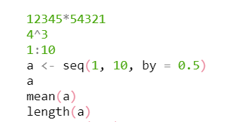

name: toc
<style type="text/css">
.remark-slide-content {
    font-family: font-family: 'Alegreya Sans', sans-serif;
    font-size: 24px;
    padding: 1em 2em 1em 2em;
}
</style>

```{r setup, include = FALSE}
knitr::opts_chunk$set(echo = TRUE)
```

# Table of Contents

1. [Terminologies](#term) 

2. [Your steps to finish for this tutorial](#instr)

3. [Software installation demo](#demo)

4. [Hands-on activity (Week 1 participation points attached)](#activity)

---
name: term
# Terminologies

 * [R](https://www.r-project.org/) is a free and open-source programming language, created by Ross Ihaka and Robert Gentleman at the University of Auckland, New Zealand.
 
 * [RStudio](https://www.rstudio.com/products/rstudio/#rstudio-desktop) is an integrated development environment (IDE) for R, serving as an interface to R.
 
  + It includes a console (a code editor that supports direct code execution) and numerous tools for plotting, history, debugging, and workspace management.
  
  + It has two versions: RStudio desktop (the software we'll be using in our computer) and RStudio server (RStudio access using a web browser)

---
name: instr
# Your Steps to Finish:

1. Download [R](https://www.r-project.org/) and install it in your computer

2. Download [RStudio Desktop](https://www.rstudio.com/products/rstudio/download/preview/) and install it in your computer

3. Get to know your RStudio and finish the hands-on activity (week 1 participation point attached)

---
name: demo
# Demo - Install R

Download R (then install it in your computer):

```{r, out.width = "85%", fig.align = "center", echo = FALSE}
knitr::include_graphics("./pics/download_r.gif")
```

---
# Demo - Install RStudio

Download RStudio Desktop (then install it in your computer):

```{r, out.width = "85%", fig.align = "center", echo = FALSE}
knitr::include_graphics("./pics/download_rstudio.gif")
```

---
name: activity
# RStudio Hands-on Activity

Open your RStudio, run these below code in your console line-by-line, copy and paste the results in a **word document**.

Create a new project in your local and an **R script** under that project, write the same code.

Submit the word doc AND the R script to Canvas to get the first week's participation point (deadline is before our first class meeting). You'll be doing this for all the assignments over this term so let's get started now.

```{r, out.width = "50%", fig.align = "center", echo = FALSE}

```

